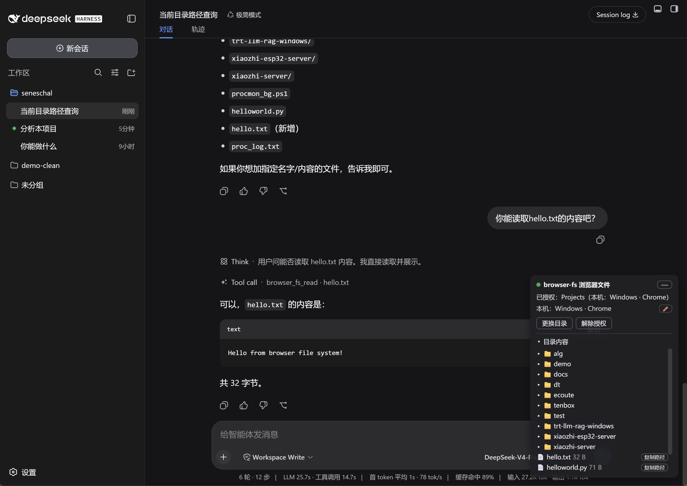

# dsh-browser-fs

**中文** | [English](README_EN.md)

[](https://github.com/awesome-dsh-plugin/awesome-dsh-plugin#tools--capabilities)

让 dsh 的 agent 读写**浏览器所在机器**的本地文件。dsh 自带的 fs 工具只能摸宿主机；
远程部署时浏览器在别的机器上，agent 够不到你本地的文件。本插件补上这个缺口：

用户在 dsh web 页面里通过 File System Access API（`showDirectoryPicker`）授权一个本地
目录，句柄存 IndexedDB；agent 通过三个模型工具 list/read/write 该目录下的文件，工具
调用经插件自建的 WebSocket 通道转发到浏览器执行。



## 原理

双面插件（cordis 插件体系）：

- **host 半**（`src/index.ts`，跑在 dsh 宿主 Node 进程）
  - `ctx.webServer.registerUpgrade` 注册精确路径 `/browser-fs/ws` 的 WS 通道；
  - `ctx.tools.register` 注册 `browser_fs_list` / `browser_fs_read` / `browser_fs_write`；
  - execute 把 `{type:'call', rpcId, op, args}` 帧发给「持有授权句柄」的标签页，按
    rpcId 配对 result 帧；`exec.signal` 接到 pending 的 abort（同时给浏览器发 cancel 帧）。
- **client 半**（`src/client/`，浏览器里跑）
  - 启动时从 IndexedDB 读回句柄并 `queryPermission`；连回 host 的 WS（断线指数退避重连）；
  - 收到 call 帧后在授权目录上执行 File System Access 操作，回发 result 帧；
  - 在 `shell.overlay` 层注册一张浮动卡片：显示连接/授权状态，提供
    授权目录 / 重新授权 / 更换目录 / 解除授权 按钮。
  - 授权状态变化时广播 `{type:'state', hasHandle, dirName}`；host 只把调用派给
    `hasHandle=true` 的标签页（多个标签在线时的执行者选择）。

## 安装

```sh
# 从 npm 装（推荐，零脚本、无需构建授权）
dsh plugin --profile web add dsh-browser-fs

# 或直接从 GitHub 装（构建产物已入库，安装零脚本）
dsh plugin --profile web add github:whitefirer/dsh-browser-fs

# 本地开发：改代码后重装（改动需先 npm run build，产物 lib/ 已纳入版本库）
npm install
npm run build
dsh plugin --profile web add file:/abs/path/to/dsh-browser-fs
# 重启 dsh 后生效
```

`dsh plugin add` 会把本包装进 profile 的 dependencies，并因 manifest 里的
`dsh.bundle.patch` 声明自动把 `dsh-browser-fs` 追加进 `dsh.profile.bundles` 层栈
（patch 内容即本仓库的 `cordis.patch.yml`：insert 一行挂 host 半，config 含
`wsPath` 与 `requestTimeoutMs`）。

## 使用

1. 打开 dsh web 页面，右下角出现「browser-fs 浏览器文件」卡片（未授权时默认展开；
   授权后默认折叠成 📁 圆钮，点一下展开、按住可拖动，「—」收起；折叠状态存
   localStorage，刷新保持，圆钮上的状态点颜色与卡片一致）；
2. 点「授权目录」，在系统选择器里选一个本地目录（需要 readwrite 权限）；
3. 卡片上的「目录内容」区可直接浏览授权目录：懒加载树（点目录行展开/收起，
   每级上限 200 条，超出显示「…还有 N 项」），文件行显示大小并带「复制路径」
   按钮（复制相对路径，方便贴给 AI）；
4. 之后 agent 即可使用三个工具：
   - `browser_fs_list { path?, recursive? }` — 列目录（相对路径/类型/大小，递归可选）
   - `browser_fs_read { path, maxBytes? }` — 读文本文件（默认上限 256 KiB，截断会标注）
   - `browser_fs_write { path, content }` — 写文本文件（自动创建父目录，返回字节数）

工具描述里明确告知模型：操作的是**浏览器机器**的本地盘，不是宿主机文件系统。

卡片界面语言跟随 dsh 的「设置 → 通用设置 → 语言」（插件订阅 dsh 客户端的
`locale` 服务，切换即时生效；无该服务的组合退回 `<html lang>`/浏览器语言）。

## 预览与刷新

「目录内容」树里**点文件名**弹出预览窗（遮罩 + 固定尺寸窗口
min(720px,92vw) × min(70vh,560px)，不随内容伸缩；标题栏钉顶——文件名 +
大小/截断标注 + ✕，其下是相对路径行；内容区独立滚动；✕ / 点遮罩 / ESC 关闭）：

- **图片**（png/jpg/jpeg/gif/webp/svg/ico/bmp）：读 arrayBuffer 建 blob URL 用
  `` 展示（关闭时 revokeObjectURL）；超过 8MB 不拉取，直接提示太大；
- **其余按文本**：只取前 64KB，UTF-8 解码，等宽 `<pre>` 展示，截断标注
  「仅前 64KB」；解码后含 NUL 字符视为二进制，显示「二进制文件不支持预览」。

预览两模式同路径（完整/兼容后端的 `readBlob` 各自实现），兼容模式只读也能用。

文本预览带**语法着色**：按扩展名映射语言（js/ts/tsx/py/go/rs/java/c/cpp/h/sh/
yaml/json/toml/md/html/css/xml/sql 等，无映射退回纯文本），先截断前 64KB 再
着色。高亮基于 highlight.js 语言子集 + GitHub Dark 主题；为控制主包体积拆成
独立 chunk —— host 半经 `/browser-fs/ws` 同目录的 `highlight.mjs` 路由供给，
预览首次命中已映射语言时才动态加载（加载中先出纯文本并标注「语法着色加载中…」，
失败静默退回纯文本）。

**卡片可拖拽换位**：标题行是拖拽把手（鼠标/触摸均可，位移 >4px 才算拖拽，
不会吃掉折叠与按钮点击）；拖动中面板/球直接贴合指针（钳位不介入），松手
与窗口 resize 时才收敛。球体始终完整留在视口内（贴边允许、不留隐性边距）。
展开面板从未拖过时以球位为锚推导初始位（球在右/下半屏就向左/上翻转展开，
仍出界再 clamp 进 10px 边距，宽高上限收到视口内）；一旦被拖过就**停在拖放
处**（只做视口内 clamp、不再翻转），且跨收起/展开与页面刷新记忆（与球位同
一个 localStorage key `dsh-browser-fs:card-pos`）。收起态的 📁 圆钮在锚点位
（卡片左上角），圆球同样按住可拖——没移动过的松手才展开。卡片/圆球/预览窗
渲染在 body 级层级（z-100/200），压过常见覆盖层（如侧边栏插件面板），点击
不被别家插件抢走，同时低于 dsh 自身模态框（z-1000+）。

授权按钮行末尾的「↻」是刷新目录：

- **完整模式**：清空目录树全部缓存（展开集合/已加载层级）并重拉根级；
- **兼容模式**：缓存即选择时的 File 快照，浏览器不允许静默重读，刷新无意义
  —— 该按钮改为重新打开目录选择器（同「重新选择」）。

## 多设备

多台设备可以各自开着 dsh 页面，模型是「各自授权各自的本机目录」：

- 每台设备的浏览器 tab 会自动派生一个设备标签（从 UA 解析，如
  "Windows · Chrome" / "Android · Chrome" / "macOS · Safari"）；卡片上点 ✏️
  可改昵称（存 localStorage `dsh-browser-fs:device-name`，昵称优先于 UA 派生）。
- 每个 tab 把 `{hasHandle, dirName, label}` 上报给 host；host 维护执行者名单
  （roster）并广播给所有在线 tab。没授权的设备会在卡片上看到
  「当前授权在设备：某某（目录名）」，不会再一脸茫然。
- agent 的工具调用路由到持柄设备：多台同时持柄时选**先接入的那台**（确定性的），
  工具结果与错误文本都带执行设备标签（如「已写入 3 字节到 b.txt（设备：X）」），
  在会话里能看出是哪台设备执行的。
- 本机再授权一个目录就成为多执行者之一；某台设备断开或解除授权，roster 即时收缩。

## 局域网/手机访问与安全上下文

File System Access API 是安全上下文门控 API：只在 HTTPS 或 localhost 下存在，
局域网 http（如 `http://192.168.0.x:9101`，常见于手机经代理访问）里
`window.showDirectoryPicker` 根本不存在，无法 polyfill。本插件按
`typeof window.showDirectoryPicker === 'function'` 做特性检测（不看
`isSecureContext`——代理注入的 polyfill 可能改过它），检测不到时自动进入
**兼容模式**，两档能力差异：

| | 完整模式 | 兼容模式 |
| --- | --- | --- |
| 触发 | 安全上下文（HTTPS/localhost） | 非安全上下文自动降级 |
| 选择方式 | 系统目录选择器（showDirectoryPicker） | 双入口：input[webkitdirectory] 选目录 / multiple 选多个文件 |
| list / read | ✓ | ✓（File 内存映射，read 按 slice 截断不整读） |
| write / 变更 | ✓ | ✗ 明确报错「兼容模式只读…」 |
| 授权持久化 | ✓ IndexedDB，刷新自动恢复 | ✗ 无句柄可存，刷新后需重选（状态行有提示） |
| 目录树浏览 | ✓ | ✓ 同路径（后端抽象两模式共用） |

**移动端行为**：兼容模式授权区是并排双入口——「选择目录」与「选多个文件」，
不再只靠属性探测自动二选一；选择器 input 用离屏定位（非 display:none，
移动端浏览器/微信 WebView 会拦隐藏 input 的编程式 click）。iOS 上目录选择
可能形同虚设（webkitdirectory 属性在、选完返回 0 个文件）：此时卡片显示明确
错误「没读到文件……请改用「选多个文件」」，且此后目录入口自动改走多选，绝不
静默无反馈。授权成功后状态行显示所选内容（目录名或「N 个文件」）。

兼容模式下卡片显示「兼容模式」徽标与说明。获得完整模式的三种途径：

1. SSH 端口转发到 localhost：`ssh -L 9101:127.0.0.1:9101 用户@主机`，然后走
   `http://127.0.0.1:9101` 访问；
2. Chrome 打开 `chrome://flags/#unsafely-treat-insecure-origin-as-secure`，
   把局域网 origin 加白；
3. 部署 HTTPS。

## 限制

- **secure context**：File System Access API 要求 HTTPS 或 localhost 上下文；
  纯 HTTP 远程访问页面时授权按钮会报明确错误。
- **标签页必须开着**：没有浏览器标签在线时，工具调用立即返回明确错误；
  有标签但没授权目录时同样立即报错。
- agent 工具只支持 UTF-8 文本读写（二进制写入不在范围；图片仅卡片内预览，见「预览与刷新」）。
- client 半固定连默认 WS 路径 `/browser-fs/ws`（高亮 chunk 路径由其同目录
  派生 `/browser-fs/highlight.mjs`）；host 半若改了 `wsPath` 配置，client 半的
  `DEFAULT_WS_PATH`（`src/wire.ts`）需同步修改并重新 build。
- host 半以 peerDependency 依赖 `@deepseek-ai/dsh-tools`（defineTool），运行时经
  profile 的扁平 node_modules 回退解析到 dsh 安装自带的同一份。

## 开发

```sh
npm run build      # esbuild：host 半 ESM + client 半 CJS 闭包（__ModuleLoader__ 包装）+ 高亮懒加载 chunk（lib/highlight.mjs）
npm run typecheck  # tsc --noEmit
npm run smoke      # 链路自检：call→result 往返 / abort / 断连 / 跨源拒绝（scripts/smoke.mjs）
```

改了代码后：重新 `npm run build`，然后 `dsh plugin --profile web add file:<本目录>`
重装一次（file: 依赖是打包拷贝，不是软链），再重启 dsh。
